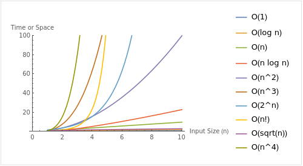

# Big O notation and complexity 

The Big O notation is used to describe the performance characteristics of an algorithm, specifically its time and space complexity. 

However, it's important to note that Big O notation provides an upper bound on the time complexity or space complexity in the worst-case scenario. It doesn't provide a complete picture of an algorithm's performance, as it doesn't account for best-case or average-case scenarios, or for constant factors and lower-order terms.

The most common time complexities that you'll encounter in algorithm analysis are:

- O(1): Constant time complexity
- O(log n): Logarithmic time complexity
- O(n): Linear time complexity
- O(n log n): Log-linear time complexity
- O(n^2): Quadratic time complexity
- O(n^3): Cubic time complexity
- O(2^n): Exponential time complexity
- O(n!): Factorial time complexity

The space complexities often mirror the time complexities, but not always. For example, an algorithm might have a time complexity of O(n^2) but a space complexity of O(n), or even O(1).

